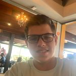

#  👀 PORTOFOLIO NICOLAS NEVES  👀

<!---Esses são exemplos. Veja https://shields.io para outras pessoas ou para personalizar este conjunto de escudos. Você pode querer incluir dependências, status do projeto e informações de licença aqui--->

----
### 👋  INTRODUÇÃO 👋 

### O projeto foi criado para ser um portofolio pessoal para mostrar como e o que sei, se estou estudando e o que estou estudando .
 ---
__________________

🧠 METODOS 🧠  

_____________________
____________________

👨🏻‍💻CONCLUSÃO  👨🏻‍💻

### esse projeto foi feito para ser uma froma de criar um portofolio pessoal e ir implementando ele para ficar cada vez melhor , implementando com:

 etc...
